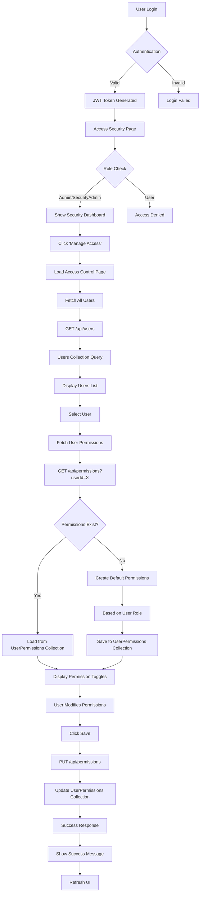
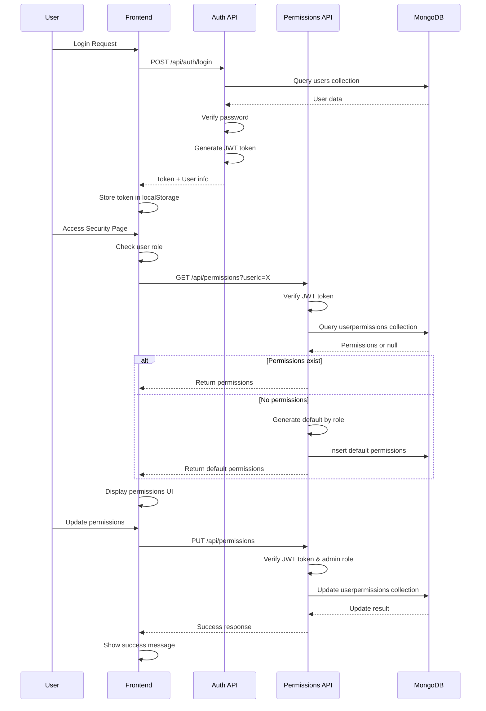
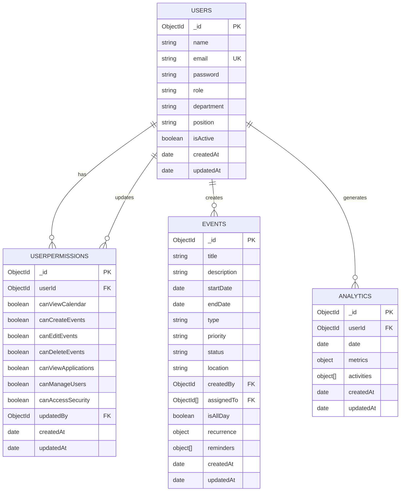
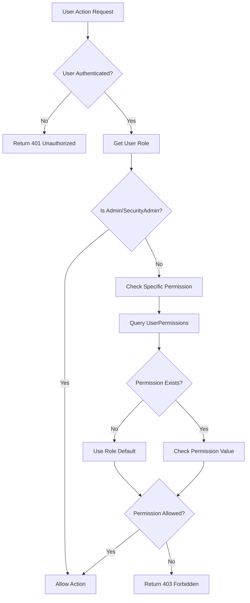

# System Data Flow & Database Structure

## 🔄 Data Flow Diagram



## 🗄️ Database Structure

### **MongoDB Collections Overview**

```
📁 Database: innovative_project
├── 📄 users
├── 📄 userpermissions
├── 📄 events
└── 📄 analytics
```

### **1. Users Collection**

```javascript
{
  _id: ObjectId("..."),
  name: "John Doe",
  email: "john@example.com",
  password: "$2b$10$...", // Hashed
  role: "user", // "user" | "admin" | "securityadmin"
  department: "Engineering",
  position: "Developer",
  isActive: true,
  createdAt: ISODate("2025-11-15T..."),
  updatedAt: ISODate("2025-11-15T...")
}
```

**Indexes:**
- `email: 1` (unique)
- `role: 1`
- `isActive: 1`

### **2. UserPermissions Collection**

```javascript
{
  _id: ObjectId("..."),
  userId: ObjectId("..."), // Reference to users._id
  canViewCalendar: true,
  canCreateEvents: true,
  canEditEvents: false,
  canDeleteEvents: false,
  canViewApplications: true,
  canManageUsers: false,
  canAccessSecurity: false,
  updatedBy: ObjectId("..."), // Reference to admin who updated
  createdAt: ISODate("2025-11-15T..."),
  updatedAt: ISODate("2025-11-15T...")
}
```

**Indexes:**
- `userId: 1` (unique)
- `updatedBy: 1`

### **3. Events Collection**

```javascript
{
  _id: ObjectId("..."),
  title: "Team Meeting",
  description: "Weekly sync meeting",
  startDate: ISODate("2025-11-20T10:00:00Z"),
  endDate: ISODate("2025-11-20T11:00:00Z"),
  type: "meeting", // "meeting" | "deadline" | "task" | "reminder"
  priority: "medium", // "low" | "medium" | "high"
  status: "scheduled", // "scheduled" | "completed" | "cancelled"
  location: "Conference Room A",
  createdBy: ObjectId("..."), // Reference to users._id
  assignedTo: [ObjectId("..."), ObjectId("...")], // Array of user references
  isAllDay: false,
  recurrence: {
    type: "weekly",
    interval: 1,
    endDate: ISODate("2025-12-31T...")
  },
  reminders: [
    {
      type: "email",
      minutesBefore: 15
    }
  ],
  createdAt: ISODate("2025-11-15T..."),
  updatedAt: ISODate("2025-11-15T...")
}
```

**Indexes:**
- `startDate: 1`
- `createdBy: 1`
- `assignedTo: 1`
- `type: 1`
- `status: 1`

### **4. Analytics Collection**

```javascript
{
  _id: ObjectId("..."),
  userId: ObjectId("..."), // Reference to users._id
  date: ISODate("2025-11-15T00:00:00Z"),
  metrics: {
    tasksCompleted: 5,
    tasksCreated: 3,
    eventsAttended: 2,
    hoursWorked: 8,
    productivityScore: 85
  },
  activities: [
    {
      type: "event_created",
      timestamp: ISODate("2025-11-15T09:30:00Z"),
      metadata: {
        eventId: ObjectId("..."),
        eventTitle: "Project Review"
      }
    }
  ],
  createdAt: ISODate("2025-11-15T..."),
  updatedAt: ISODate("2025-11-15T...")
}
```

**Indexes:**
- `userId: 1, date: 1` (compound, unique)
- `date: 1`

## 🔐 Authentication & Authorization Flow



## 📊 Data Relationships



## 🚀 API Endpoints & Data Flow

### **Authentication Endpoints**
```
POST /api/auth/login
├── Input: { email, password }
├── Process: Verify credentials, generate JWT
└── Output: { token, user }

POST /api/auth/register
├── Input: { name, email, password, role }
├── Process: Hash password, create user
└── Output: { user }

POST /api/auth/logout
├── Input: JWT token
├── Process: Invalidate session
└── Output: { success }
```

### **User Management Endpoints**
```
GET /api/users
├── Input: Query params (page, limit, search, role)
├── Process: Query users collection with filters
└── Output: { users[], pagination }

POST /api/users
├── Input: { name, email, password, role }
├── Process: Create new user
└── Output: { user }

PUT /api/users/:id
├── Input: { name, role, department, position }
├── Process: Update user document
└── Output: { user }

DELETE /api/users/:id
├── Input: User ID
├── Process: Remove user and related data
└── Output: { success }
```

### **Permissions Endpoints**
```
GET /api/permissions?userId=X
├── Input: User ID
├── Process: Query userpermissions collection
├── Fallback: Create default permissions by role
└── Output: { permissions }

PUT /api/permissions
├── Input: { userId, canViewCalendar, canCreateEvents, ... }
├── Process: Upsert permissions document
└── Output: { permissions }
```

### **Events Endpoints**
```
GET /api/events
├── Input: Query params (startDate, endDate, type, etc.)
├── Process: Query events collection with filters
└── Output: { events[], pagination }

POST /api/events
├── Input: { title, startDate, endDate, type, ... }
├── Process: Create event, check permissions
└── Output: { event }

PUT /api/events/:id
├── Input: Event updates
├── Process: Update event, check permissions
└── Output: { event }

DELETE /api/events/:id
├── Input: Event ID
├── Process: Remove event, check permissions
└── Output: { success }
```

## 🔄 Permission Checking Flow



## 📈 Performance Considerations

### **Database Indexes**
- **Users**: `email` (unique), `role`, `isActive`
- **UserPermissions**: `userId` (unique), `updatedBy`
- **Events**: `startDate`, `createdBy`, `assignedTo`, `type`, `status`
- **Analytics**: `userId + date` (compound, unique), `date`

### **Caching Strategy**
- User permissions cached in frontend localStorage
- JWT tokens cached for 7 days
- User session data cached during app session

### **Query Optimization**
- Pagination for large datasets
- Filtered queries with indexes
- Aggregation pipelines for analytics
- Lean queries for better performance

This flowchart shows the complete data flow from user authentication through permission management, including all database interactions and API endpoints in your system.
